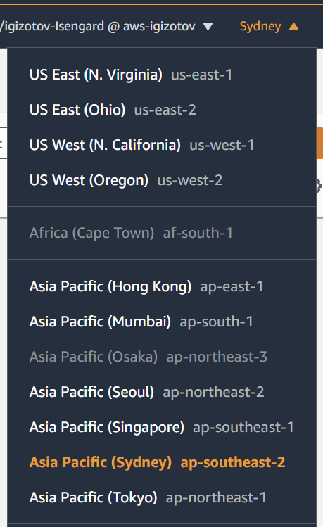

# Welcome to CDK Workshop

## Getting Started
You have been provided with an AWS Account to run this workshop. 

1. Browse to https://dashboard.eventengine.run/ and enter your participant hash key to login to your AWS account:
   
    

2. Click **Email One-Time Password (OTP)** to receive your one-time password. You can use your personal or corporate email:
   
   

3. Enter your email and click **Send passcode**:
   
   

4. Enter your passcode and click **Sign in**
   
   

5. Now click on **AWS Console** to log into the AWS Console:
   
   

6. In the pop-up window, click **Open AWS Console**, the Console will open in a new browser tab:

   
   
7. In the Console, make sure you're in the Sydney (ap-southeast-2) AWS Region - the region selector is in the top right corner:

   
   

8. We provisioned a Cloud9 environment with the necessary prerequisites - open [this link](https://console.aws.amazon.com/cloud9/home) in a new browser tab and click **Open IDE** to access it:

   

9.  You can rearrange tabs and panes within your Cloud9 environment as needed, we recommend the following layout with two bash sessions at the bottom, file lister on the left and the code editor at the top:

   

Congrats, you're in! Please continue to https://cdkworkshop.com/20-typescript.html and return here for more fun when you're done with the workshop

# Bonus section: understanding resource lifecycle
Click [here](lifecycle.md)
