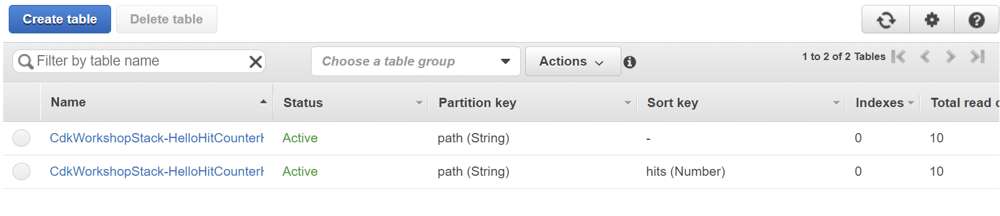

# Bonus section: understanding resource lifecycle

This section assumes that you've the [CDK Workshop](https://cdkworkshop.com/20-typescript.html) 

1. Edit `lib/hitcounter.ts` and introduce a sort key to our DynamoDB table to improve performance:

    ```ts
        const table = new dynamodb.Table(this, "Hits", {
        partitionKey: {
            name: "path",
            type: dynamodb.AttributeType.STRING
        },
        //add from here
        sortKey: {
            name: "hits",
            type: dynamodb.AttributeType.NUMBER
        },
        //to here
        serverSideEncryption: true,
        readCapacity: props.readCapacity ?? 5
    ```

2. run `cdk diff`. Notice that DynamoDB will be replaced:
   ```
   Stack CdkWorkshopStack
    Resources
    [~] AWS::DynamoDB::Table HelloHitCounter/Hits HelloHitCounterHits7AAEBF80 replace
   ```

3. run `cdk deploy` and navigate to the [DynamoDB Console](https://ap-southeast-2.console.aws.amazon.com/dynamodb/home?region=ap-southeast-2#tables:). Notice two DynamoDb tables. One of them does not have any values, why. Read more on `RemovalPolicy` in this [blog post](https://bobbyhadz.com/blog/set-deletion-policy-aws-cdk)

    